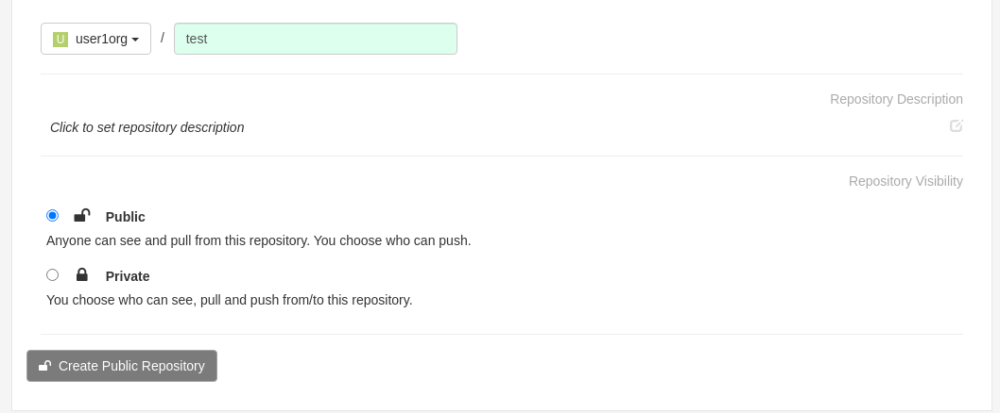

b 1 - Organizations

## Login to Quay
From a web browser (Chrome / Firefox), Navigate to the Quay URL provided by your instructor.
Your username is `user` with your user number appended like so: `user3`. Each user's password is set to `openshift` by default. 

Once logged in, you'll be presented with the Quay dashboard. Notice a few things here true of a new user:


* Quay presents 3 Links at the top of the page (EXPLORE, REPOSITORIES, and TUTORIAL). The `TUTORIAL` link walks you through the full cycle of pushing an image into your Quay instance. This is great any time you need a quick refresher.
* You have no `Organizations` created. However, you can create repositories under your username, which acts somewhat like an Organization.
* The UI is prompting you to `Create New Organization` on the right.

*Note: Organization names must be globally unique to your Quay instance. For example, if you attempt to create an organization named `user1`, Quay will prevent you from creating this Org, because by default, each user starts with an org created in their account using their username. Repositories, however, are only required to be unique within a given organizations namespace. As an example the following two repos can co-exist without collision:*

```
myquay.com/user1/repo1

myquay.com/user2/repo1
```

## Create an Organization
Let's start by creating an Organization.
* Click - `Create New Organization`


* Name this Organization `userXorg`, where `X` is your assigned user number.


* Click `Create Organization`


## Create a Repository


* Click `Create New Repository` in the top right of the UI.

* Ensure `userXorg` is selected in the drop down list of Organizations.

* Name the organization `test`.

* Change the `Repository Visibility` to `Public`.

* Optionally, set a repository description by clicking in and changing the default text that states `Click to set repository description`

* Click `Create Public Repository`



* Navigate back to the dashboard by clicking the `RED HAT QUAY` icon in the top left of the page.
* Notice you now have two organizations, `userX` and `userXorg`. Your `userXorg` organization contains one repository named `test`.


## Next Lab:
[Previous](https://github.com/mbach04/quay_workshop_instructions/blob/master/README.md) | [Next](https://github.com/mbach04/quay_workshop_instructions/blob/master/lab2.md)


