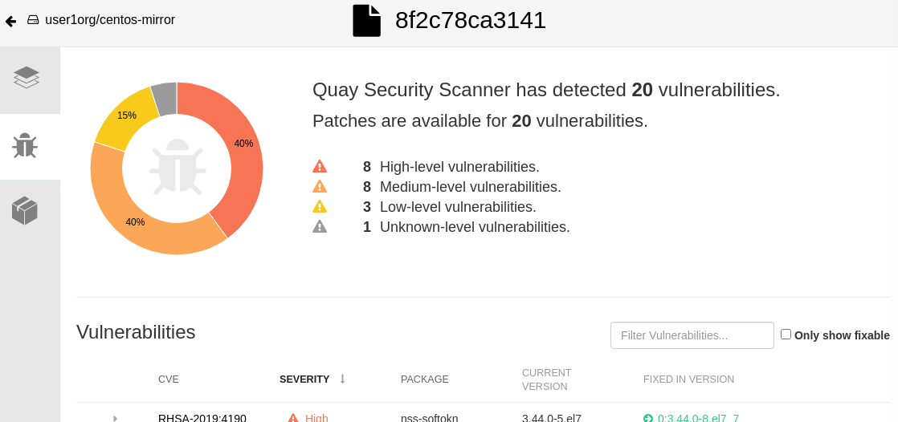

# Lab 3 - Inspecting image layers and CVE's

Quay includes a deep integration with [Clair](https://github.com/quay/clair), the open source image security scanning tool. The same team that engineers Quay also builds Clair. This integration is helpful when inspecting the content of an image to determine if it's security posture is suitable for your environment. Quay, when deployed to OpenShift using the Operator can optionally deploy this scanner as an additional container running on the platform.

* Navigate to the `user1org/centos-mirror` repository
* Click the `Tags` icon on the left (icon pictured above)
* You should have a tag listed `7.7.1908`, with several `High` and `fixable` results shown under the `SECURITY SCAN` field. Let's explore this one.
* Click on the `SHA256` value (8f2c78ca3141), listed under `MANIFEST`
* You should now see the layers dashboard as depicted in the image below

* Quay has extracted the various Dockerfile directives that comprise this image. Inspect the 3 directives included in this image `CMD`, `LABEL`, and `ADD`. This is a fairly simple image, as it's meant to be a starting point for your applications. This feature is more useful when inspecting more robust images that intend to run applications.
* Click the `Security Scan` icon on the left, depicted in the image below.

* You should now see the Security Scan Dashboard like the picture, similar to the picture below. If not, give your Quay instance a few minutes to complete it's scan from Clair, and refresh your browser.:

## Explore the vulnerability data
This image was intentionally chosen to showcase CVE findings. 

Notice, Quay has correlated the findings to Red Hat Security Advisories (RHSA's) or Red Hat Bug Advisories (RHBA's), the package and version that produced the finding and included the synopsis of the finding for each item. Clicking the dropdown arrow on a given CVE will display the detailed description for a given RHSA/RHBA. Additionally, Quay is displaying the `SEVERITY` of the finding, and a reference to the version of the package that remediates this finding.

* Click the packages icon as shown in the image below

The Packages Dashboard is a alternative view to the Security Dashboard. In this page you'll find a list of packages found in the image, listed out by `UPGRADE IMPACT` severity. Meaning, that Quay is recommending which packages are in *most* need of an upgrade to improve this image.

