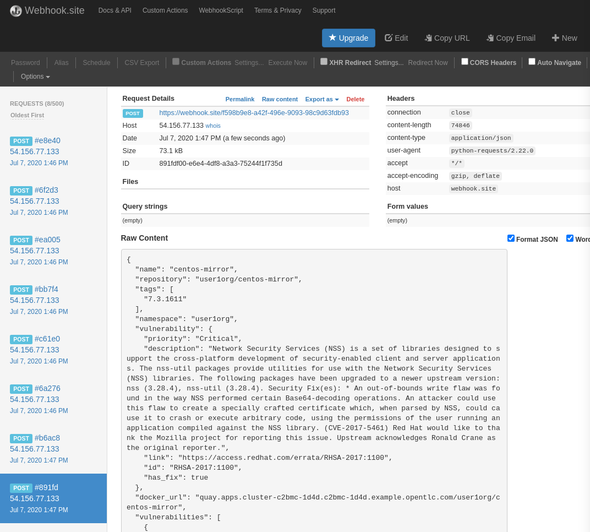

# Lab 4 - Notifications

Quay comes with a number of notifications that can be used to perform actions based on image events. Some of these events allow for additional filtering as well. The triggers for these notications include:
* Pushing to a repository
* Starting a repository mirror operation
* A successfulful repository mirror operation
* A failed resposiroty mirror operation
* A Package Vulnerability was found

These notifications can be used as trigger events to build out more complex image management pipelines or integrated into existing environments.

## Create a Mirror Success Notification
* From the Red Hat Quay Dashboard, click on your `centos-mirror` repository
* Click the `Settings` Gear shaped icon
* Under `Events and Notifications`, click `+ Create Notification`
* In the `When this event occurs` drop down, select `Repository Mirror Success`
* Under the `Then issue a notification` drop down, select `Red Hat Quay Notification`
* In the `Recipient` text field, type `userX` to notify yourself each time a mirror is successful
* Click `Create Notification` to save this

Recall from `Lab 2 - Repo Mirroring`, we set our Centos mirror to fire every 60 secs. So we should expect a notice in the top of our dashboard to increment roughly every minute as well. (pictured below)


Clicking on the bell will show you what notifications have fired. Note, if you're not seeing an update, try refreshing your page. If these become annoying, you can delete the previous notification in the settings configuration page for the `centos-mirror` repo.

# Create a Vulnerability Found Action
Having a simple alert pop up in the dashboard is helpful, but to achieve a greater state of automation, we really need to hook into external systems. When a system publishes a means to interface with it, we say this software has an API (Application Programming Interface). An API sets forth a contract that we can rely on to communicate with a system, enabling deeper automation to occur. 

For this portion of the lab, we're going to trigger an arbitrary action each time a vulnerability is met for a certain threshold. In this case, each time Quay detects a `HIGH` level vulnerability, the notification will trigger an API call to an external system. To keep this simple, we're going to use [Webhook.site](https://webhook.site/). Webook.site is a simple service that generates a random endpoint for each user. Users can browse to this endpoint to obtain debugging information about the calls that have been made to it. This is useful for the case of this lab, as it showcases the ability of Quay to POST to an outbound service, while not requiring us to setup additional lab services such as an API Gateway. The takeaway is, that this integration can work with any system that is capable of hosting a webhook. Some examples are OpenShift Container Platform, Ansible Tower, Slack, Rocket Chat, ServiceNow and so on. This offers a robust and flexible way to take an event occurence in Quay, and program an automated action.

* In a new browser tab, navigate to [Webhook.site](https://webhook.site/) and find `Your unique URL`. Save this to the clipboard, we'll need it in a moment. It should look something like: `https://webhook.site/f598b9e8-a42f-496e-9093-98c9d63fdb93`
* Notice on the left hand pane of the webhook site, it's waiting for a request to happen. This service has automatically created a unique end point for us to send information to, which we'll use to configure in Quay.
* Back on your Quay browser tab, Navigate to the settings page of your `centos-mirror` repo.
* Click `+ Create Notification`
* From the `When this event occurs` drop down, select `Package Vulnerability Found`.
* From the `With minimum severity level` drop down, select `High`
* From the `Then issue a notification` drop down, select `Webhook POST`.
* In the `Webhook URL` field, paste in your unique webhook.site URL you captured above.
* Optionally provide a `Notification Title` in the last field, for a human friendly notification title to be included.

Previously in Lab 2, we set Quay to mirror a specific tag, and a wildcard for all tags that start with `8.`. Because these images have already been scanned, they will not fire our new notification until a new tag or a new `HIGH` vulnerability is detected. In order to demonstrate our webhook integration, we'll add another tag for our `centos-mirror` to pull down.

* From the `centos-mirror` repo, click the `mirror` icon shown below:


* Click on the list of tags in the `Tags` field
* The `Update Tag Filter` dialog is shown. Append `7.*` to your tags filter so that it looks like the example below:
```
7.7.1908,8.*,7.*
```
*Note, for ease, you can also just copy and paste the syntax into your tags field, over writing the previous values.
* Click `Update`

* Open your Webhook.site tab that we navigated to earlier. 

Within 60 seconds or so, you should see a list of `POST` actions begin to populate the left side of the page. The webhook site allows you to debug the content of the POST action that was sent to your custom endpoint. This data can be used to trigger follow on actions in your pipelines and automation. Notice in the `Raw Content`, there is a wealth of information available to explore in a JSON format. 

Example POST received on the webhook site:


